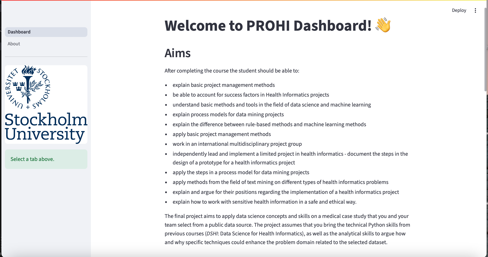
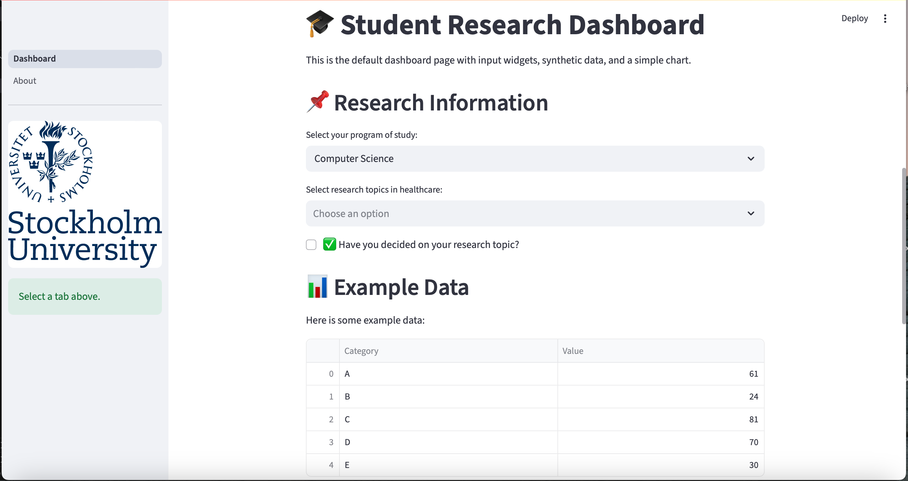
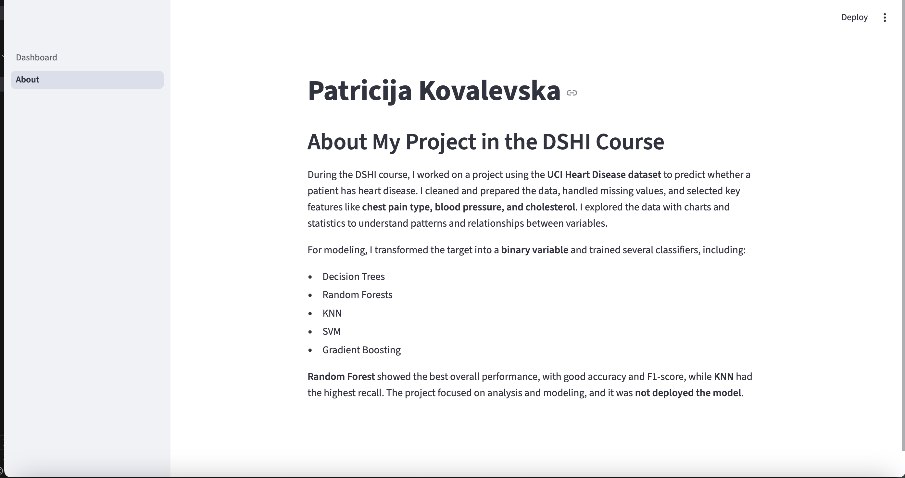

# PROHI Dashboard Example

**Author**: Patricia
**Collaborator**:Qilu Wang

_Note that this file is written in **MarkDown** language. A reference is available here: <https://www.markdownguide.org/basic-syntax/>_


## Website Overview
This is an **Streamlit dashboard** that visualizes requirement in individual work 2. The website allows users to entries 3 data: studying program, reserach topic and decision about research topic. Second page About shows information about another project I did last sesmeter.

## Pages
- **Home:** Data entries and key statistics  
- **About:** Summary of the project and methodology  

## Screenshots
### Home Page



### About Page


### Website link: 
Local URL: http://localhost:8501
Network URL: http://172.17.113.84:8501

---------------------------------------------


## Introduction

_This template project will contain a simple interactive web dashboard with Streamlit. Feel free to edit this document as desired_

## System description

### Installation of libraries

Run the commands below in a terminal to configure the project and install the package dependencies for the first time.

If you are using Mac, you may need to install Xcode. Check the official Streamlit documentation [here](https://docs.streamlit.io/get-started/installation/command-line#prerequisites).

1. Create the environment with `python -m venv env`
2. Activate the virtual environment for Python
   - [Linux/Mac] `source env/bin/activate` 
   - [Windows command prompt] `.\env\Scripts\activate.bat` 
   - [in Windows PowerShell] `.\env\Scripts\Activate.ps1`
3. Make sure that your terminal is in the environment (`env`) not in the global Python installation. The terminal should start with the word `env`
4. Install required packages `pip install -r ./requirements.txt`
5. Check that the installation works running `streamlit hello`
6. Stop the terminal by pressing **Ctrl+C**

### Execute custom Dashboard

First, make sure that you are running Python from the environment. Check the steps 2 and 3 above. Then, to run the custom dashboard execute the following command:

```
> streamlit run Dashboard.py
# If the command above fails, use:
> python -m streamlit run Dashboard.py
```

### Dependencies

Tested on Python 3.12.7 with the following packages:
  - Jupyter v1.1.1
  - Streamlit v1.46.1
  - Seaborn v0.13.2
  - Plotly v6.2.0
  - Scikit-Learn v1.7.0
  - shap v0.48.0

## Contributors

Patricija Kovalevska
+371 22999330
